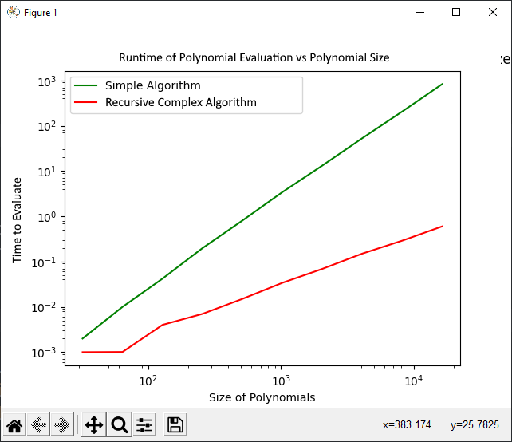

# Quick Assignment01

## Graph


## Equations
```
SIMPLE ALGORITHM: time = 0.0000019045 * n ^ 2.0610428260
Complex Recursive: time = 0.0000184707 * n ^ 1.0752347885
```

## Analysis
The complex version of the algorithm is wicked fast. It essentially splits the problem into two half sized subproblems, each of which does n work. This means that, according to the master theorem, it will do
```
n * log(n)
```
work. In reality it's actually closer to just *n*, which is pretty much a result of the algorithm doing almost 0 work on any individual step. It's not surprising that the simple algorithm is almost n ^ 2, as it calculates n points for a polynomial of the nth degree, without any optimization.  