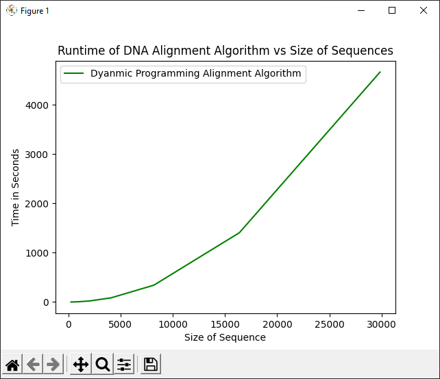
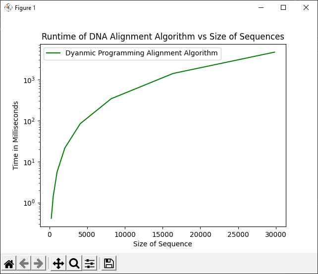
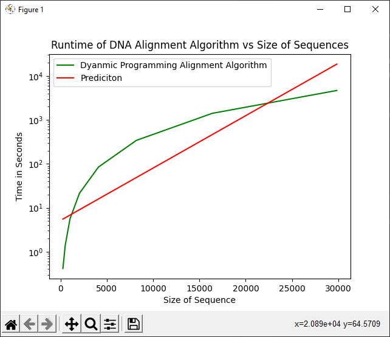

# Code

Code can be foudn in the **proteinSeq.py** file.

# Sequence Alignment Scores

For this section, each possible pair of sequences had its alignment score calculated. As this takes forever, only the first 1000 characters were used for the majority of sequence pairs. Code for this section can be found in **problems.py**, function: **compareSequences()**. 

## Sequence Key

|    Sequence Index    |         Sequence Name                  |    
|----------------------|----------------------------------------|
|0                     | hCoV-19/USA/IL-RIPHL_80083_G/2021      |
|1                     | hCoV-19/USA/IL-RIPHL_40210_G/2021      |
|2                     | hCoV-19/Spain/CT-BST9925843103/2021    |
|3                     | hCoV-19/Spain/CT-BST9925852072/2021    |
|4                     | hCoV-19/Spain/CT-BST9925852366/2021    |
|5                     | hCoV-19/Spain/CT-BST9925843170/2021    |
|6                     | hCoV-19/USA/KY-KSPHL-101052/2021       |
|7                     | hCoV-19/Poland/WSSEGorzow-21S0427/2021 |
|8                     | hCoV-19/Poland/WSSEGorzow-21S0424/2021 |
|9                     | hCoV-19/USA/TX-HHD-2108310764/2021     |
|10                    | hCoV-19/USA/TX-HHD-4646274/2021        |
|11                    | hCoV-19/USA/TX-HHD-4641933/2021        |
|12                    | hCoV-19/USA/TX-HHD-2108313070/2021     |
|13                    | hCoV-19/USA/TX-HHD-2108264362/2021     |


## Alignment Values for Each Sequence Pair

|    | 0     | 1     | 2     | 3     | 4     | 5     | 6     | 7     | 8     | 9     | 10    | 11    | 12    | 13    |
|----|-------|-------|-------|-------|-------|-------|-------|-------|-------|-------|-------|-------|-------|-------|
| 0  | x     | 29787 | x     | x     | x     | x     | x     | x     | x     | x     | x     | x     | x     | x     |
| 1  | x     | x     | x     | x     | x     | x     | x     | x     | x     | x     | x     | x     | x     | x     |
| 2  | x     | x     | x     | x     | x     | x     | x     | x     | x     | x     | x     | x     | x     | x     |
| 3  | x     | x     | x     | x     | x     | x     | x     | x     | x     | x     | x     | x     | x     | x     |
| 4  | x     | x     | x     | x     | x     | x     | x     | x     | x     | x     | x     | x     | x     | x     |
| 5  | x     | x     | x     | x     | x     | x     | x     | x     | x     | x     | x     | x     | x     | x     |
| 6  | x     | x     | x     | x     | x     | x     | x     | x     | x     | x     | x     | x     | x     | x     |
| 7  | x     | x     | x     | x     | x     | x     | x     | x     | x     | x     | x     | x     | x     | x     |
| 8  | x     | x     | x     | x     | x     | x     | x     | x     | x     | x     | x     | x     | x     | x     |
| 9  | x     | x     | x     | x     | x     | x     | x     | x     | x     | x     | x     | x     | x     | x     |
| 10 | x     | x     | x     | x     | x     | x     | x     | x     | x     | x     | x     | x     | x     | x     |
| 11 | x     | x     | x     | x     | x     | x     | x     | x     | x     | x     | x     | x     | x     | x     |
| 12 | x     | x     | x     | x     | x     | x     | x     | x     | x     | x     | x     | x     | x     | x     |
| 13 | x     | x     | x     | x     | x     | x     | x     | x     | x     | x     | x     | x     | x     | x     |

### String Alignment Printout

The Printout function simply lines up the sequences, with | symbols representing gaps. Everything else is either a substitution or a match (self-substitution).

```

Start of String Alignment
-------------------------
A     A
A     A
A     A
G     G
G     G
T     T
T     T
T     T
A     A
T     T
A     A
C     C
C     C
------
|     C
------
T     T
T     T
C     C
C     C
C     C
A     A
G     G
G     G
T     T
A     A
A     A
C     C
A     A
A     A
A     A
C     C
C     C
A     A
A     A
C     C
C     C
A     A
A     A
C     C
T     T
T     T
T     T
C     C
G     G
A     A
T     T
C     C
T     T
C     C
T     T
T     T
G     G
T     T
A     A
G     G
A     A
T     T
C     C
T     T
G     G
T     T
T     T
C     C
T     T
C     C
T     T
A     A
A     A
A     A
C     C
G     G
A     A
A     A
C     C
T     T
T     T
T     T
A     A
A     A
A     A
A     A
T     T
C     C
T     T
G     G
T     T
G     G
T     T
G     G
G     G
C     C
T     T
G     G
T     T
C     C
A     A
C     C
T     T
C     C
G     G
G     G

```

*Note: If you really want it all, I included all 84 Printouts for the Alignment of the First 1000 Characters in Printouts.md, But this is the Only Printout for the Full Length Alignment.*


## Alignment Values of the First 1000 Characters in Each Sequence Pair

|    | 0     | 1     | 2     | 3     | 4     | 5     | 6     | 7     | 8     | 9     | 10    | 11    | 12    | 13    |
|----|-------|-------|-------|-------|-------|-------|-------|-------|-------|-------|-------|-------|-------|-------|
| 0  | x     | 989   | 911   | 911   | 911   | 911   | 983   | 875   | 845   | 904   | 839   | 833   | 953   | 914   |
| 1  | x     | x     | 908   | 908   | 908   | 908   | 994   | 872   | 842   | 901   | 836   | 830   | 950   | 911   |
| 2  | x     | x     | x     | 1000  | 1000  | 1000  | 902   | 956   | 926   | 979   | 920   | 914   | 950   | 989   |
| 3  | x     | x     | x     | x     | 1000  | 1000  | 902   | 956   | 926   | 979   | 920   | 914   | 950   | 989   |
| 4  | x     | x     | x     | x     | x     | 1000  | 902   | 956   | 926   | 979   | 920   | 914   | 950   | 989   |
| 5  | x     | x     | x     | x     | x     | x     | 902   | 956   | 926   | 979   | 920   | 914   | 950   | 989   |
| 6  | x     | x     | x     | x     | x     | x     | x     | 866   | 836   | 907   | 830   | 836   | 944   | 905   |
| 7  | x     | x     | x     | x     | x     | x     | x     | x     | 962   | 943   | 956   | 950   | 914   | 953   |
| 8  | x     | x     | x     | x     | x     | x     | x     | x     | x     | 913   | 989   | 980   | 884   | 923   |
| 9  | x     | x     | x     | x     | x     | x     | x     | x     | x     | x     | 907   | 913   | 943   | 990   |
| 10 | x     | x     | x     | x     | x     | x     | x     | x     | x     | x     | x     | 994   | 878   | 917   |
| 11 | x     | x     | x     | x     | x     | x     | x     | x     | x     | x     | x     | x     | 872   | 911   |
| 12 | x     | x     | x     | x     | x     | x     | x     | x     | x     | x     | x     | x     | x     | 953   |
| 13 | x     | x     | x     | x     | x     | x     | x     | x     | x     | x     | x     | x     | x     | x     |

### String Alignment Printout

*See Printouts.md*

# Timing Study

For this section, a timing study was done on sequences 0 and 1, comparing geometrically increasing lengths of subsequences and the time it took the algorithm to calculate their score. Code for this can be found in **problems.py**, functions: **compareTiming()** and **graphTimings()**.
## Raw Data

| Sequence Length | Time Elapsed (s) |
|------------------------------------|
| 256             | 0.41             |
| 512             | 1.42             |
| 1024            | 5.60             |
| 2048            | 21.42            |
| 4096            | 84.26            |
| 8192            | 341.21           |
| 16384           | 1406.43          |
| 29848           | 46667.09         |


## Graph (Linear)



## Graph (Logarithmic)



## Graph (Logarithmic w/ Best Fit)



## Line of Best Fit

***y* = 5.14418 * 1.00027<sup>*n*</sup>**


# Summary

## Why the Line of Best Fit Makes Sense
Honestly, it's not too suprising that the base for the line of best fit is almost one. This problem doesn't experience exponential growth, so an exponential model shouldn't be a very good fit, as we can see by the graph. However, as we can see from the linear graph, our function shouldn't quite be linear either. It's somehwere in the range of geometric, which makes sense as the table in question is *n X n*, leading to something close to *O(n<sup>2</sup>)* complexity.

## Observations
It's honestly kind of impressive that an algorithm like this can work on such massive data sets. The FASTA file is by far the largest I've ever used for any of my programs before, so it's amazing that it actually runs. I also found it suprising that the traceback was so fast, when the dynamic programming element took so long, but if you think about it the traceback avoids branching at every step, so it's work done is essentially *O(n)*. When it comes to the results, it was somewhat suprising to see that, for the first 1000 characters at least, some of the sequences were literally identical. But, considering it's only 1000 out of about 30000, it's not that crazy. When it comes to the full length analysis, the two strings ended with a score of over 29000, meaning pretty much the entire sequences matched, which is a lot more suprising. It just goes to show that mutations can have big effects despite being only tiny changes in a dna sequence. 


## Why This Algorithm is Scientifically Important
This algorithm is amazing because it actually allows alignment to be calculated for real world sequences. If we'd tried to handle strings of nearly 30,000 characters in length with our recursive function (which makes a mininmum of 2 calls per call), we could've had over *2<sup>30,000</sup>* function calls, which is honestly enough to crash any machine. Now, with a dynamic programming approach, this is not only possible, but possible on a home computer system. This means that pretty much anyone, anywhere, at anytime can test for alignments, and with a complicated and important field like virology, the more poeple involved, the better. 