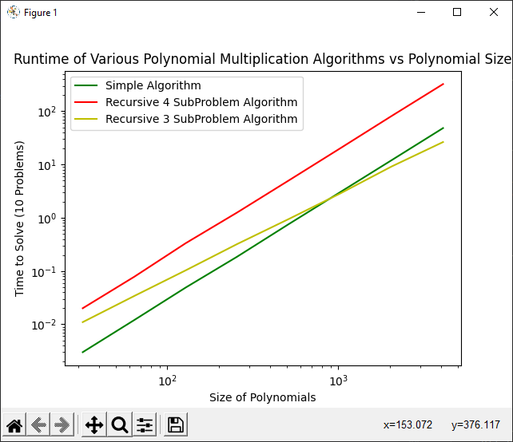

# Assignment03 Report

## Code
Code can be found in the *polymul.py* and *timings.py* files.
The *polymul.py* file contains the algorithms, and the *timings.py* file contains the functions needed to compare timings. Simply run the *timings.py* file to see a graph of the timing results, and a printout of the equations for each algorithm. If you'd like to adjust some parameters, you can run the functions in the file as indicated by their doc strings.

## Timing Results
### Size and Timing Results (S)

| Algorithm/Size | 32.0                 | 64.0                 | 128.0               | 256.0               | 512.0              | 1024.0             | 2048.0             | 4096.0             |
| -------------- | -------------------- | -------------------- | ------------------- | ------------------- | ------------------ | ------------------ | ------------------ | ------------------ |
| Simple         | 0.002999544143676758 | 0.012006044387817383 | 0.04897809028625488 | 0.18599891662597656 | 0.7580232620239258 | 3.0180001258850098 | 12.033029317855835 | 48.2312273979187   |
| 4SP            | 0.020029544830322266 | 0.07800078392028809  | 0.33299899101257324 | 1.2560005187988281  | 4.998006820678711  | 20.05999732017517  | 81.30747365951538  | 323.164345741272   |
| 3SP            | 0.010995864868164062 | 0.03399014472961426  | 0.10299992561340332 | 0.3210012912750244  | 0.9449996948242188 | 2.851971387863159  | 9.172967195510864  | 26.385311603546143 |


## Graph


## Equations
```
SIMPLE ALGORITHM: time = 0.0000029994 * n ^ 1.9942685513
4SP ALGORITHM: time = 0.0000197695 * n ^ 1.9964746287
3SP ALGORITHM: time = 0.0000425297 * n ^ 1.6060954295
```
## Theoretical Results
For the three subproblem solution, based on the name, and the actual implementation, we can clearly see that each step results in 3 more recursive calls. This gives us an A of 3. The problem halves itself in size for each call, giving us a B of 2. Finally, the work done in each call is proportional to n, giving us a k of 1. Overall, the equation to represent this function's runtime is given by:
```
f(n) = 3 * (n / 2) + c * n ^ 1
```

B ^ k gives us 2 ^ 1. A is greater than this, so we use the approximation f(n) = n ^ (log(a) / log(b)). This gives us a final equation of:
```
f(n) =(approximatley) c * n ^ 1.585 
```

## Analysis
C actually increased when jumping to the recursive algorithm. This simply means that the recursive algorithm has more overhead for solving a problem than the iterative one does, which makes sense as recursion is expensive, and we're doing all sorts of loops and slices inside of the actual function. When it comes to k for the 3 SubProblem algorithm, it's actually insanely close to the theoretical value. It's understandable that it'd be off a little bit as the "Master Theorem" is only an approximation. There's also all sorts of measurement error going on in the code as well, and it seems that at larger values of n, the slope decreases slightly, making it an even better match, but that's hard to see on the given graph. 