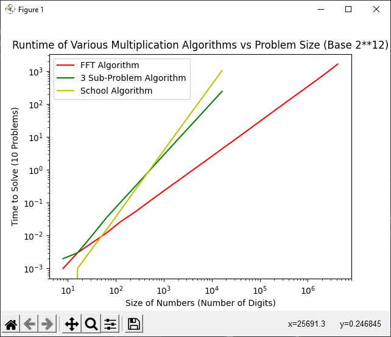
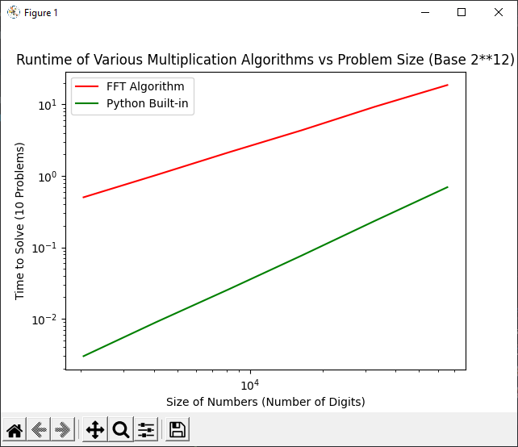

# Assignment04
## Jacob Fitzgerald (A02261889)

## Code
Code for this assignment can be found in the *fft.py* and *testfft.py* files. All code for running mulitiplication algorithms is located in the *fft.py* file, while all testing and timing code referenced in this document is located in the *testfft.py* file. 

### Problem 1
Code for the random number generator can be found under the function name *randomBaseK*. This function accepts *n*, the number of numbers to generate (power of 2) and *k*, the base to generate in (defaults to 2^12). It returns a list of random integers ranging from 0 to *k* - 1.

#### Example Code
```
print(randomBaseK(10))
```

#### Example Output
```
[3431, 494, 3233, 3941, 1586, 2317, 3117, 4020]
```

### Problem 2
Code for testing the FFT can be found under the funciton name *testFFTWorks*. This function accepts *n*, the number of times to test the FFT algorithm, *s*, the size of the problem to test, and *v* which toggles verbose mode. It returns True if the FFT algorithm matches the schoolbook algorithm for all test cases, false otherwise. 

#### Example Code
```
print(testFFTWorks(10, v=True))
```

#### Example Output
```
School Algorithm:[1712690, 12749790, 20973738, 21831303, 25820435, 33043959, 41005800, 35200092, 30207644, 38780099, 47991907, 46529589, 53649555, 61693853, 79161279, 82898522, 72498080, 61376138, 60100595, 55543622, 42466809, 35687191, 30934054, 40540707, 34114685, 26997303, 30022367, 19389146, 19169868, 8850026, 738322, 0]
FFT Algorithm   :[1712690, 12749790, 20973738, 21831303, 25820435, 33043959, 41005800, 35200092, 30207644, 38780099, 47991907, 46529589, 53649555, 61693853, 79161279, 82898522, 72498080, 61376138, 60100595, 55543622, 42466809, 35687191, 30934054, 40540707, 34114685, 26997303, 30022367, 19389146, 19169868, 8850026, 738322, 0]
School Algorithm:[7410912, 17196184, 12854952, 13510650, 27635876, 26746571, 27175451, 35384367, 42273099, 46425120, 46437502, 63707963, 59728543, 70470597, 67050440, 76329743, 65738701, 68726678, 66958165, 62584943, 58928066, 48394576, 48349883, 36741028, 45597840, 31358478, 29810937, 12345629, 13195513, 6770303, 6461508, 0]
FFT Algorithm   :[7410912, 17196184, 12854952, 13510650, 27635876, 26746571, 27175451, 35384367, 42273099, 46425120, 46437502, 63707963, 59728543, 70470597, 67050440, 76329743, 65738701, 68726678, 66958165, 62584943, 58928066, 48394576, 48349883, 36741028, 45597840, 31358478, 29810937, 12345629, 13195513, 6770303, 6461508, 0]
School Algorithm:[3713171, 7693519, 16953838, 19015755, 32312688, 33091188, 40043715, 52984849, 65662271, 74582293, 81904822, 77474931, 94192616, 97156176, 102874995, 107067763, 95001256, 95939597, 86061441, 72477944, 73502677, 66107932, 56618407, 48468432, 33261734, 30780546, 22727272, 15842754, 13342017, 6831609, 1562608, 0]
FFT Algorithm   :[3713171, 7693519, 16953838, 19015755, 32312688, 33091188, 40043715, 52984849, 65662271, 74582293, 81904822, 77474931, 94192616, 97156176, 102874995, 107067763, 95001256, 95939597, 86061441, 72477944, 73502677, 66107932, 56618407, 48468432, 33261734, 30780546, 22727272, 15842754, 13342017, 6831609, 1562608, 0]
True
```

#### Analysis
The FFT seems to produce the correct results for small problem sizes at the very least. 

### Problem 3

Code for this problem can be found under the *timeMultiplicationFunctions* and *timeMultiplicationFunctions* function names. The *timeMultiplicationFunctions* function accepts *functions* a list of functions to test, *start*, a starting problem size, *stop*, a stopping problem size, *problems*, the number of times to test each problem size, *v*, which toggles verbose mode, *cutoff*, which specifies a point at which to only run the last function, and *includePython*, which includes the basic python multiplication algorithm in the test. This function returns a collection of lists, each list containing timing points for one of the specified functions. The *graphTimings* function accepts the timing collection generated from the previous function, as well as a list of names for the algorithm. It then estimates the time equation for each algorithm, and graphs the data points.

#### Requested Code
```
times = timeMultiplicationFunctions([PQ_FFT, mult3, PQ_school], 8, 2**22, v=True, cutoff=2**14)
graphTiming(times, ["FFT Algorithm", "3 Sub-Problem Algorithm", "School Algorithm"])
```

#### Output
```
Running Tests for Size n=8
Running Tests for Size n=16
Running Tests for Size n=32
Running Tests for Size n=64
Running Tests for Size n=128
Running Tests for Size n=256
Running Tests for Size n=512
Running Tests for Size n=1024
Running Tests for Size n=2048
Running Tests for Size n=4096
Running Tests for Size n=8192
Running Tests for Size n=16384
Running Tests for Size n=32768
Running Tests for Size n=65536
Running Tests for Size n=131072
Running Tests for Size n=262144
Running Tests for Size n=524288
Running Tests for Size n=1048576
Running Tests for Size n=2097152
Running Tests for Size n=4194304


FFT Algorithm: time = 0.00014213 * n ^ 1.06425304
3 Sub-Problem Algorithm: time = 0.00004871 * n ^ 1.58655449
School Algorithm: time = 0.00000000 * n ^ 57.02804585
[BUGGED OUTPUT DUE TO INCLUDING SMALL PROBLEM SIZES ACTUAL VALUE ~ 0.00000323 * n ^ 2.02208085]

```

#### Graphs


#### Analysis
Notes:
Including a really small value (8) in my algorithm threw off the results for the School Algorithm due to log weirdness. The calculations were done using results from earlier tests which showed it being about 0.00000323 * n ^ 2.02208085. Also, it should be noted my Three Sub-Problem algorithm was cut off a power of 2 or so too early, but enough data was collected to get the point across. 

Using the approximated equations for each algorithm we get the following results for largest solvable problem size in 20 minutes or less.

##### Schoolbook
```
~16,000
Rounded Down to Nearest Power of 2: 2 ** 14
```

##### Three Sub-Problem
```
~55,000
Rounded Down to Nearest Power of 2: 2 ** 15
```

##### FFT
```
~7,000,000
Rounded Down to Nearest Power of 2: 2**22
```

### Problem 4
Code for this problem can be found under the *testAccuracy* function name. This function accepts *start*, a starting problem size, *stop*, a maximum problem size, *problems*, the number of times to test the FFT for each problem size, and *v*, which toggles verbose mode. It returns true if the FFT is accurate over all problems, false otherwise.

#### Example Code
```
print(testAccuracy(2, 2**12, v=True))
```

#### Example Output
```
MATCHED at n=2.
MATCHED at n=2.
MATCHED at n=2.
MATCHED at n=2.
MATCHED at n=2.
MATCHED at n=2.
MATCHED at n=2.
MATCHED at n=2.
MATCHED at n=2.
MATCHED at n=2.
MATCHED at n=4.
MATCHED at n=4.
MATCHED at n=4.
MATCHED at n=4.
MATCHED at n=4.
MATCHED at n=4.
MATCHED at n=4.
MATCHED at n=4.
MATCHED at n=4.
MATCHED at n=4.
MATCHED at n=8.
MATCHED at n=8.
MATCHED at n=8.
MATCHED at n=8.
MATCHED at n=8.
MATCHED at n=8.
MATCHED at n=8.
MATCHED at n=8.
MATCHED at n=8.
MATCHED at n=8.
MATCHED at n=16.
MATCHED at n=16.
MATCHED at n=16.
MATCHED at n=16.
MATCHED at n=16.
MATCHED at n=16.
MATCHED at n=16.
MATCHED at n=16.
MATCHED at n=16.
MATCHED at n=16.
MATCHED at n=32.
MATCHED at n=32.
MATCHED at n=32.
MATCHED at n=32.
MATCHED at n=32.
MATCHED at n=32.
MATCHED at n=32.
MATCHED at n=32.
MATCHED at n=32.
MATCHED at n=32.
MATCHED at n=64.
MATCHED at n=64.
MATCHED at n=64.
MATCHED at n=64.
MATCHED at n=64.
MATCHED at n=64.
MATCHED at n=64.
MATCHED at n=64.
MATCHED at n=64.
MATCHED at n=64.
MATCHED at n=128.
MATCHED at n=128.
MATCHED at n=128.
MATCHED at n=128.
MATCHED at n=128.
MATCHED at n=128.
MATCHED at n=128.
MATCHED at n=128.
MATCHED at n=128.
MATCHED at n=128.
MATCHED at n=256.
MATCHED at n=256.
MATCHED at n=256.
MATCHED at n=256.
MATCHED at n=256.
MATCHED at n=256.
MATCHED at n=256.
MATCHED at n=256.
MATCHED at n=256.
MATCHED at n=256.
MATCHED at n=512.
MATCHED at n=512.
MATCHED at n=512.
MATCHED at n=512.
MATCHED at n=512.
MATCHED at n=512.
MATCHED at n=512.
MATCHED at n=512.
MATCHED at n=512.
MATCHED at n=512.
MATCHED at n=1024.
MATCHED at n=1024.
MATCHED at n=1024.
MATCHED at n=1024.
MATCHED at n=1024.
MATCHED at n=1024.
MATCHED at n=1024.
MATCHED at n=1024.
MATCHED at n=1024.
MATCHED at n=1024.
FAILED. Mismatch at n=2048. [FORMAT TOO LARGE TO FIT IN DOCUMENT]
False
```

#### Analysis
As you can see from the codes output, at around 2^11 (2048), the FFT starts to generate incorrect results. After running these tests multiple times, it appears to always fail at that exact number, which is somewhat interesting. I haven't run tests using a different base, which might have a different effect on the results. I've also omitted the erronous numbers from this report, as they were too large to fit in realistically.  


### Problem 5
Code for this problem is identical to code for problem 3. Simply set *includePython* to True in the *timeMultiplicationFunctions* function to see timing data for the python built-in multiply. It should be noted that, as python built-in is so fast, if you run the code with a small starting value, the predicted equations will return wonky/inaccurate results. 

#### Requested Code
```
times = timeMultiplicationFunctions([PQ_FFT], 2048, 2**16, v=True, includePython=True)
graphTiming(times, ["FFT Algorithm", "Python Built-in"])
```

#### Output
```
Running Tests for Size n=2048
Running Tests for Size n=4096
Running Tests for Size n=8192
Running Tests for Size n=16384
Running Tests for Size n=32768
Running Tests for Size n=65536
FFT Algorithm: time = 0.00017105 * n ^ 1.04678877
Python Built-in: time = 0.00000002 * n ^ 1.56995752
```

#### Graphs


#### Analysis
The "slope" of the FFT algorithm is around 1, while the "slope" of Python's built-in is around 1.56. This makes me beleive that Python uses the three sub-problem algorithm, which has a very similar slope. However, it's pretty hard to tell, as the speed of python's multiply makes it hard to get accurate test results. 