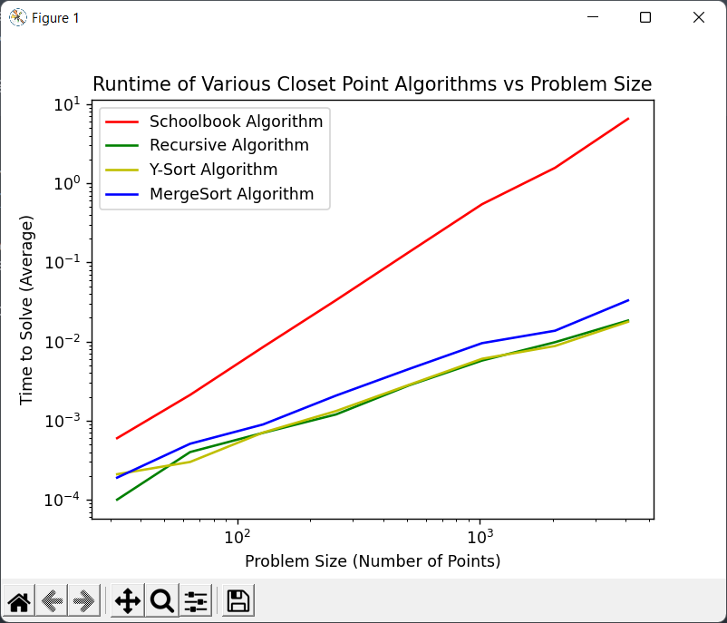

# Assignment05
## Jacob Fitzgerald (A02261889)

## Code
Code for this assignment can be found in the *clostestpoints.py*, *testpoints.py* and *timings.py* files. All code for running closest points algorithms is located in the *closestpoints.py* file, while test code is located in *testpoints.py* and timing code is located in *timings.py*. 

### Problem 1
Code for the random problem generater can be found in the *testpoints.py* file, under the createProblem function. This funciton accepts n, the problem size, and returns an array of n points with x and y values ranging from [0, 100).

#### Example Code
```
print(createProblem(4))
```

#### Example Output
```
[[96.73545145176902, 48.41026399673305], [92.52208460384028, 25.33411223538552], [55.847410592262555, 19.548176738831824], [64.57967369897176, 41.96472434139733]]
```

### Problem 2
Code for the Y-Sort version of the closest pair can be found in the *closestpoints.py* file, under the closestPairY function. This function accepts a list of points, and n, the length of the list of points (this must be a power of 2). 

#### Example Code
```
problem = createProblem(4)
print(problem)
print(closestPairY(problem, 4))
```

#### Example Output
```
[[6.407666160865366, 62.003354498998256], [2.6790181619223974, 70.1249727101412], [79.76690791601007, 52.99143062570103], [49.14514457116842, 99.05997289079468]]
8.93663797339861
```


### Problem 3

Code for the MergeSort version of the closest pair can be found in the *closestpoints.py* file, under the closestPairMerge function. This function accepts a list of points, and n, the length of the list of points (this must be a power of 2). 

#### Example Code
```
problem = createProblem(4)
print(problem)
print(closestPairMerge(problem, 4))
```

#### Output
```
[[6.407666160865366, 62.003354498998256], [2.6790181619223974, 70.1249727101412], [79.76690791601007, 52.99143062570103], [49.14514457116842, 99.05997289079468]]
8.93663797339861
```

### Problem 4
Code for this problem can be found in the *testpoints.py* file, under the testEqual() function. This function accepts algorithms, a list of algorithms to test, generator, a problem generator, times, the number of times to test each function, and size, the size of the problems to test the functions on, and v, a verbose flag. It returns true if the functions produce identical results, false otherwise. 

#### Example Code
```
testEqual([close, closestPair, closestPairY, closestPairMerge], createProblem, 10, 2 ** 10)
```

#### Example Output
```
1th Test
---------------
Algorithm 1: 0.05726862238652555
Algorithm 2: 0.05726862238652555
Algorithm 3: 0.05726862238652555
Algorithm 4: 0.05726862238652555
Algorithms Equal

2th Test
---------------
Algorithm 1: 0.0010454263781660494
Algorithm 2: 0.0010454263781660494
Algorithm 3: 0.0010454263781660494
Algorithm 4: 0.0010454263781660494
Algorithms Equal

3th Test
---------------
Algorithm 1: 0.06804942206468313
Algorithm 2: 0.06804942206468313
Algorithm 3: 0.06804942206468313
Algorithm 4: 0.06804942206468313
Algorithms Equal

4th Test
---------------
Algorithm 1: 0.013503134681386754
Algorithm 2: 0.013503134681386754
Algorithm 3: 0.013503134681386754
Algorithm 4: 0.013503134681386754
Algorithms Equal

5th Test
---------------
Algorithm 1: 0.07964349387282495
Algorithm 2: 0.07964349387282495
Algorithm 3: 0.07964349387282495
Algorithm 4: 0.07964349387282495
Algorithms Equal

6th Test
---------------
Algorithm 1: 0.034631980643858126
Algorithm 2: 0.034631980643858126
Algorithm 3: 0.034631980643858126
Algorithm 4: 0.034631980643858126
Algorithms Equal

7th Test
---------------
Algorithm 1: 0.09563378643165572
Algorithm 2: 0.09563378643165572
Algorithm 3: 0.09563378643165572
Algorithm 4: 0.09563378643165572
Algorithms Equal

8th Test
---------------
Algorithm 1: 0.0751476906829321
Algorithm 2: 0.0751476906829321
Algorithm 3: 0.0751476906829321
Algorithm 4: 0.0751476906829321
Algorithms Equal

9th Test
---------------
Algorithm 1: 0.05938063945082863
Algorithm 2: 0.05938063945082863
Algorithm 3: 0.05938063945082863
Algorithm 4: 0.05938063945082863
Algorithms Equal

10th Test
---------------
Algorithm 1: 0.09880918963719357
Algorithm 2: 0.09880918963719357
Algorithm 3: 0.09880918963719357
Algorithm 4: 0.09880918963719357
Algorithms Equal

Algorithms Equal Over All Tests
```

#### Analysis
As the functions all produce the exact same results over such large problems, repeatedly, its pretty safe to say they all act the same. 

### Problem 5
Code for this problem can be found in the *timings.py* file under the timePointsFunctions() and graphTimings() functions. The timePointsFunctions() accepts functions, a list of functions to time, generator, a problem generator, start, a start problem size (must be a power of 2), stop, a maximum problem size (must be a power of 2), problems, the number of times to test each problem size, and v, a verbose flag. It returns a list of list of points, each list representing a funcion, and each point representing a timing sample. graphTimings accepts timings, a timing object as generated above, and functionNames, a list of function names to graph. 

#### Example Code
```
timings = timePointFunctions([close, closestPair, closestPairY, closestPairMerge], createProblem, 2**5, 2**12, v=True)
graphTiming(timings, ["Schoolbook Algorithm", "Recursive Algorithm", "Y-Sort Algorithm", "MergeSort Algorithm"])
```

#### Output
```
Running Tests for Size n=32
Running Tests for Size n=64
Running Tests for Size n=128
Running Tests for Size n=256
Running Tests for Size n=512
Running Tests for Size n=1024
Running Tests for Size n=2048
Running Tests for Size n=4096
Schoolbook Algorithm: time = 0.00000076 * n ^ 1.92329828
Recursive Algorithm: time = 0.00000424 * n ^ 1.02436009
Y-Sort Algorithm: time = 0.00000710 * n ^ 0.94704870
MergeSort Algorithm: time = 0.00000612 * n ^ 1.03790572
```

#### Graphs


#### Analysis
The algorithms all have the same slope, of about 1, except the schoolbook algorihtm, which has a slope of around 2. For the shcoolbook algorithm this makes sense, as the function is 2 nested for loops. For the others, as we'll see later, this doesn't quite make sense if we only consider their recurrence relationships, but if we think about it we're calculating average performance here, not worse case.

### Problem 6

#### ClosestPair
Reccurance Relationship:
```
T(n) = 2 * T(n / 2) + n ^ 2
```

Closed Form:
```
T(n) = O(n ^ 2)
```

#### ClosestPairY
```
T(n) = 2 * T(n / 2) + n * log(n)
```

#### ClosestPairMerge
Recurrance Relationship:
```
T(n) = 2 * T(n / 2) + n
```

Closed Form:
```
T(n) = O(n * log(n))
```

#### Analysis
If we only look at the reccurance relationship, the fastest algorithm should be the MergeSort version of our algorithm as it's order n * log(n). The slowest should obviously be the schoolbook versoin, ClosestPair, as it's order n^2. However, as we know, big O notation only gaurentees a "good" worst case for very large datasets, and certain datasets, even if they are random, can still favor other algorithms.

### Problem 7
As we can see in problem 5, the merge version of our algorithm actually has inferior perforance compared to the others. This is due to in part the small problem size, and in part the fact that none of the algorithms really hit their "worst case". The schoolbook algorithm is actually the exception, as it always does the same amount of work due to it's loop based implementation. It basically is the worst case personified. In the case of the closestPair algorithm, the worst case happens when you have a group of tightly grouped points (on the y axis) located very close to the center (with very similar x values), but located on either side. Due to how the band is calculated, it's actually possible for every point to be within the band, which will result in n^2 performance. This trend holds for the Y-Sort and MergeSort versions as well, as the band constitutes the majority of "unavoidable" work. The larger the band, and the harder it is to reduce, the worse the performance of these algorithms will be, even though they only perform a much smaller amount of work on it. Either way, our problems are random, as so the band is actually pretty small in comparison to the rest of the points, which leads to the near linear time caused by the divide and conquer portion of each algorithm. 