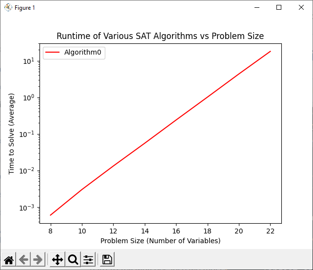
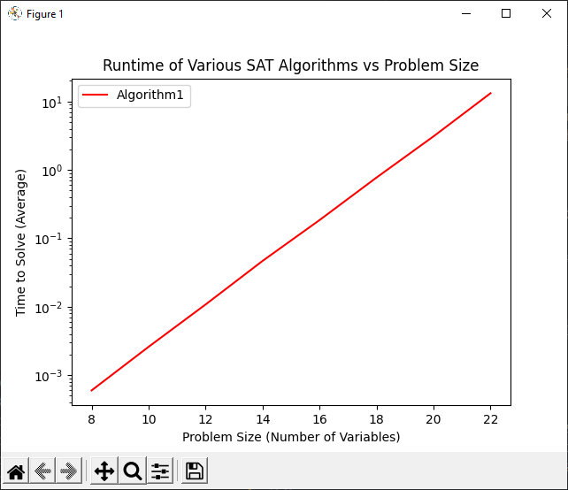
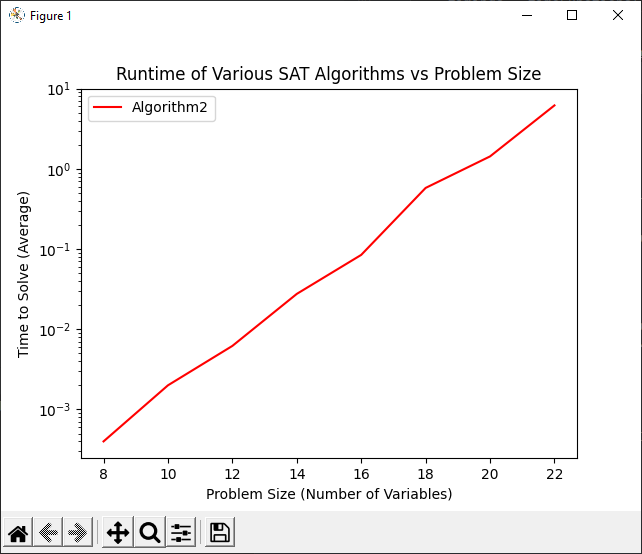
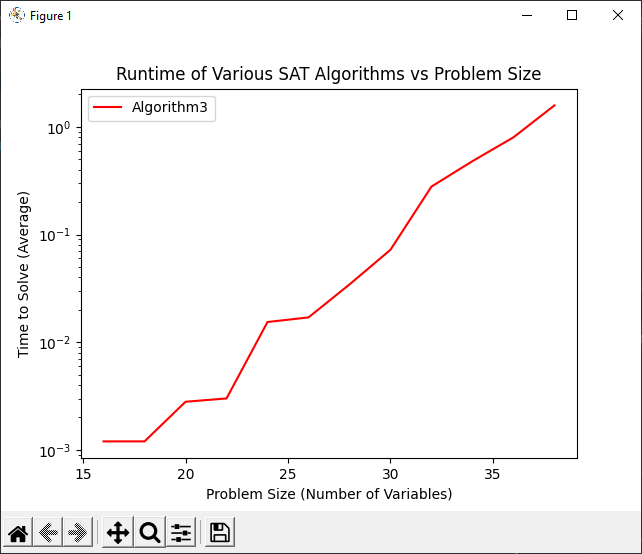
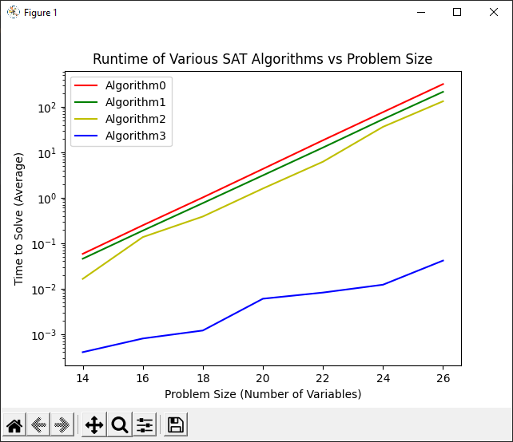
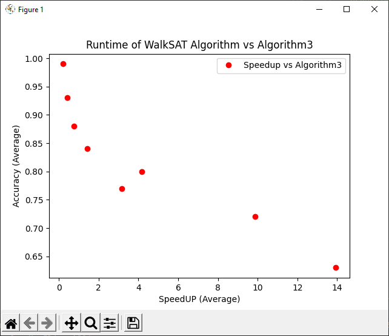

# Assignment 07

## Problem 1

For this problem, we simply had to test the provided code by running a number of simulations. I chose to run simulations of size 20, which ended up taking quite a while. The code to do so can be seen in *tests.py* under the problem1 function.

**Results:**
```
Solution is False
Solution is False
Solution is  True 
Variables = F T T F F F T T F T F T T F T F T T F T 
Clauses 
(T T F )
(T F T )
(F T F )
(T F T )
(T F T )
(T T F )
(F T F )
(T F F )
(T F F )
(F T T )
(T F T )
(F T F )
(F T F )
(T F F )
(F F T )
(F F T )
(F F T )
(T T T )
(T T F )
(T F F )
(T T F )
(F T F )
(T T T )
(F T F )
(T F T )
(T F T )
(T F F )
(F F T )
(F T F )
(F T F )
(T F F )
(F T T )
(F F T )
(F F T )
(F F T )
(T T F )
(T T T )
(F F T )
(T T T )
(F F T )
(T T T )
(F T F )
(F T T )
(F T F )
(F T T )
(T T F )
(F T F )
(F T F )
(T T F )
(T T T )
(F T T )
(T F F )
(T T T )
(F T T )
(F T F )
(F T F )
(F T F )
(T F F )
(T T F )
(T T T )
(T T T )
(F F T )
(F T F )
(T T T )
(T F F )
(T F T )
(T F F )
(T F T )
(T F T )
(T F T )
(T F F )
(F F T )
(T T T )
(T F F )
(T T T )
(T F T )
(T T F )
(F T F )
(T F F )
(T T F )
(T T F )
(T F F )
(T F F )
(F F T )
(T F F )
(T F F )
Solution is  True 
Variables = T T T T T T T F F F T T F F F F T F F T 
Clauses 
(F F T )
(T F T )
(F T T )
(F F T )
(T T F )
(T T F )
(F T F )
(F T F )
(F F T )
(F F T )
(T F F )
(T T F )
(T T T )
(T T F )
(T T T )
(T F T )
(F T T )
(F T T )
(T F T )
(F T F )
(T F T )
(T F T )
(F T F )
(F T T )
(F T F )
(T T T )
(F T F )
(F T T )
(T F F )
(T T F )
(T T F )
(T F T )
(F T F )
(T T F )
(T F F )
(T T T )
(T F F )
(F F T )
(F T T )
(F T F )
(T T F )
(T F T )
(T T T )
(T F F )
(T T T )
(F T F )
(T T F )
(T F T )
(T F T )
(F F T )
(F T F )
(F T F )
(T T F )
(T F F )
(F F T )
(T F T )
(T T F )
(T F F )
(T F F )
(T T T )
(F F T )
(T F T )
(F T F )
(F F T )
(F F T )
(F T T )
(F F T )
(F F T )
(F T T )
(T F F )
(F F T )
(F T F )
(T T T )
(F T T )
(T F F )
(T T F )
(T F T )
(F T F )
(F T T )
(T T F )
(F T F )
(F F T )
(T T T )
(F T T )
(T F T )
(F T F )
Solution is  True 
Variables = F T T T T F T F T F F F T F T T T F F F 
Clauses 
(T T F )
(T T T )
(T F F )
(F T T )
(T T T )
(F T F )
(F F T )
(F T F )
(F T F )
(F F T )
(F T F )
(F F T )
(T F T )
(F T F )
(T T T )
(F T F )
(T F T )
(T T T )
(F T F )
(T F F )
(T F T )
(T F T )
(T T F )
(T T F )
(T T T )
(T F F )
(F T T )
(F T T )
(T F T )
(F F T )
(T T T )
(F F T )
(F T F )
(F F T )
(T F T )
(T T T )
(F F T )
(T T T )
(T F T )
(F F T )
(F T T )
(T T T )
(F T T )
(F F T )
(T T T )
(T T F )
(F T F )
(T F F )
(T T F )
(F T T )
(F F T )
(T T F )
(T F F )
(T F F )
(T F T )
(T F F )
(T F T )
(T F F )
(T T T )
(F T T )
(T F F )
(F F T )
(T F T )
(T T T )
(T T F )
(F T T )
(T T F )
(F T F )
(F T F )
(T T T )
(T T F )
(T F F )
(F F T )
(T T F )
(F F T )
(F T T )
(T T F )
(F T F )
(F T T )
(T F F )
(T F F )
(T F F )
(T F F )
(T F T )
(F F T )
(T T F )
Solution is False
Solution is  True 
Variables = F T T T T T F F T T F F T T T T T F T T 
Clauses 
(T T T )
(F T F )
(F T F )
(F T F )
(F T T )
(T T T )
(F T F )
(T T F )
(T T F )
(F F T )
(T T T )
(T T F )
(T F T )
(F F T )
(T F T )
(T F F )
(T F F )
(T F F )
(T F F )
(F T T )
(T F T )
(T T T )
(F T F )
(T F T )
(T T F )
(F T F )
(T T T )
(T T F )
(T T F )
(T F F )
(T F T )
(F F T )
(T T F )
(F T T )
(T T T )
(F T F )
(T T F )
(F F T )
(F T T )
(F T F )
(F T T )
(T T F )
(F T F )
(T T T )
(T F F )
(F F T )
(F T T )
(T T F )
(T T T )
(T F F )
(T F T )
(T F F )
(T T F )
(T T T )
(F T F )
(T T T )
(F T F )
(T T F )
(F T F )
(T T T )
(T T F )
(F T F )
(F T T )
(T T T )
(T T F )
(T T F )
(T F T )
(F T T )
(T T T )
(T F T )
(F T T )
(F F T )
(T F F )
(T T T )
(T T T )
(T F F )
(F T F )
(T T F )
(T T T )
(F F T )
(F F T )
(T T T )
(T T T )
(T T F )
(T F T )
(F T T )
Solution is False
Solution is False
Solution is False
```

**Analysis:**
Overall, it looks like our code is working, without doing some sort of hand calculation, we can't be absolutely sure, but we should be good to trust this code. 

## Problem 2

For this problem, we had to run a simple timing study of our first algorithm, which we'll call algorithm0. It's pretty easy to just reuse slightly modified timing code from older assignments. In this case, however, since our algorithm is so inefficient, instead of doubling the problem size, it's best to increase it by a small amount, like 2. In order to avoid error at low values due to machine precision, we also started our approximation at 8. The largest size we can evaluate in a reasonable time frame is probably around 24, so we set 22 as our maximum bound since we're testing several problems. So overall, we're generating timing data from n=8 to n=24 in intervals of two to ensure the best possible results. 

After we grab our timing data, it's best to do a linear log plot of the results. That's because we expect our equation to be O(2^n), or in other words time  = c * 2 ^ n. In this case, taking the log of both sides gives us log(time) = n * log(2) + log(c). This means that the log of our time will have a linear relationship with n. 

The code for doing all this can be found in the *tests.py* file under the problem2 function. The functions used for timing and graphing are timeFunctions and graphTimings respectively, also found in the *tests.py* file.

**Results:** 
```
Algorithm0: time = 0.73232251 * 2.07990560 ^ n
```


**Analysis:**

Overall, our results are pretty much exactly as expected. Our base for the exponential algorithm is approximately 2, which makes sense because we create two possible branches at each step in our recursive solution. 


## Problem 3

For this problem, we have to improve the way our algorithm evaluates expressions. Once it's found a single false clause, there's no reason to keep on testing the rest of them, as the entire expression is now false. In order to add this improvement, we can simply update the evalExp to short circuit on fail. We'll call this new algorithm algorithm1. Code for it can be found in the *implementations.py* file under the algorithm 1 function. 

Overall, this should lead to a very small overall change in our algorithms performance. It simply means that dead end solutions will take slightly less time to evaluate on average, and should have no effect on the growth of our function. 

In order to test if these improvements changed anything, we can rerun our timing study with the new algorithm. Code for this can be found in the *tests.py* file under the problem3 function.

**Results:**
```
Algorithm1: time = 0.71201200 * 2.03808776 ^ n
```


**Analysis:**
As yoyu can see, our base and our coefficient are slightly smaller than before. It's entirley possible that some of this is due to noise, but it does seem that our change has had some small effect. 

## Problem 4

For this problem, we simply have to add a short circuit evaluation to our algorithm, creating a new algorithm that we can call algorithm2. Even if we find a valid solution, our algorithm still explores all paths, and, since we're only interested in if the problem is solvable, and not every possible solution, this is a pretty big waste of time. However, this will only help when a solution exists, so for the problems with out a solution, there will be zero benefit. Additionally, the overall benefit should be pretty low even if there is a solution. At the very least, it shouldn't affect the rate at which our problem time grows.

This new algorithm can be found in the *implementations.py* file under the algorithm1 function.

To test our algorithm again, we can rerun our timing study. Code for doing this can be found in the *tests.py* file, under the problem4 function.

**Results:**
```
Algorithm2: time = 0.68526101 * 1.98428969 ^ n
```


**Analysis:**
In this case, we can see a slightly larger improvement from problem3, but still nothing major. One thing to note is that our base actually did go down, but not by much. As mentioned before, this is mostly due to the fact that our change will have no effect if there is no solution to the problem. Another side effect of this is the "bumpiness" of our graph. Since we're only testing 5 problems per size, there's a pretty good chance that some sizes had almost no solutions compared to others that might have had several.

## Problems 5 and 6

For this problem, it starts to get a little trickier. If we think about it, the only way for our algorithm to produce a result is if it "bottoms out", that is, if it builds an entirely complete solution to test. However, this may not be entirely necessary. Once all the variables in a clause have been giving values, we can test if that clause is false, if that's the case, we know that no solution exists containing that specific subset of variable values. This means we can cut off our problem generation way earlier, making it so we don't have to test large groups of possible solutions. 

The actual implementation of this is a little tricky. One way to do it is to create an array of lists, which tells you at what point certain clauses are fulfilled. This will of course be dictated by the highest numbered variable in each clause. Code for this function can be found in the *implementations.py* file under the algorithm3 function. 

Since we're reworking the function completely, it's a good idea to test if it produces the same results. To do this, we can copy and modify our timing function. This code can be found in the *tests.py* file under the testEqual function. Code for testing and timing this problem can be found in the *tests.py* file under the problem6 function.

**Results:**
```
Running Tests for Size n=8
    Problem 0:
        Function 0: False -> Pass
        Function 1: False -> Pass
    Problem 1:
        Function 0: True -> Pass
        Function 1: True -> Pass
    Problem 2:
        Function 0: True -> Pass
        Function 1: True -> Pass
    Problem 3:
        Function 0: False -> Pass
        Function 1: False -> Pass
    Problem 4:
        Function 0: True -> Pass
        Function 1: True -> Pass
Running Tests for Size n=10
    Problem 0:
        Function 0: True -> Pass
        Function 1: True -> Pass
    Problem 1:
        Function 0: True -> Pass
        Function 1: True -> Pass
    Problem 2:
        Function 0: False -> Pass
        Function 1: False -> Pass
    Problem 3:
        Function 0: True -> Pass
        Function 1: True -> Pass
    Problem 4:
        Function 0: False -> Pass
        Function 1: False -> Pass
Running Tests for Size n=12
    Problem 0:
        Function 0: False -> Pass
        Function 1: False -> Pass
    Problem 1:
        Function 0: True -> Pass
        Function 1: True -> Pass
    Problem 2:
        Function 0: True -> Pass
        Function 1: True -> Pass
    Problem 3:
        Function 0: False -> Pass
        Function 1: False -> Pass
    Problem 4:
        Function 0: True -> Pass
        Function 1: True -> Pass
Running Tests for Size n=14
    Problem 0:
        Function 0: True -> Pass
        Function 1: True -> Pass
    Problem 1:
        Function 0: True -> Pass
        Function 1: True -> Pass
    Problem 2:
        Function 0: True -> Pass
        Function 1: True -> Pass
    Problem 3:
        Function 0: False -> Pass
        Function 1: False -> Pass
    Problem 4:
        Function 0: True -> Pass
        Function 1: True -> Pass
Running Tests for Size n=16
    Problem 0:
        Function 0: True -> Pass
        Function 1: True -> Pass
    Problem 1:
        Function 0: True -> Pass
        Function 1: True -> Pass
    Problem 2:
        Function 0: True -> Pass
        Function 1: True -> Pass
    Problem 3:
        Function 0: True -> Pass
        Function 1: True -> Pass
    Problem 4:
        Function 0: False -> Pass
        Function 1: False -> Pass
Running Tests for Size n=18
    Problem 0:
        Function 0: False -> Pass
        Function 1: False -> Pass
    Problem 1:
        Function 0: True -> Pass
        Function 1: True -> Pass
    Problem 2:
        Function 0: False -> Pass
        Function 1: False -> Pass
    Problem 3:
        Function 0: True -> Pass
        Function 1: True -> Pass
    Problem 4:
        Function 0: True -> Pass
        Function 1: True -> Pass
Running Tests for Size n=20
    Problem 0:
        Function 0: True -> Pass
        Function 1: True -> Pass
    Problem 1:
        Function 0: True -> Pass
        Function 1: True -> Pass
    Problem 2:
        Function 0: False -> Pass
        Function 1: False -> Pass
    Problem 3:
        Function 0: False -> Pass
        Function 1: False -> Pass
    Problem 4:
        Function 0: False -> Pass
        Function 1: False -> Pass
Running Tests for Size n=22
    Problem 0:
        Function 0: True -> Pass
        Function 1: True -> Pass
    Problem 1:
        Function 0: True -> Pass
        Function 1: True -> Pass
    Problem 2:
        Function 0: True -> Pass
        Function 1: True -> Pass
    Problem 3:
        Function 0: False -> Pass
        Function 1: False -> Pass
    Problem 4:
        Function 0: True -> Pass
        Function 1: True -> Pass
```

For timing, we can just keep using the same function, however, this function is a little funky at small values of n, so it's best to start from a much larger value, and go to a much larger value, to avoid rounding error.

**Results:**
```
Algorithm3: time = 0.35231373 * 1.42235469 ^ n
```


**Analysis:**
Because our function produces the same results as algorithm2, it's pretty safe to say that it's accurate, or at least as accurate as our previous algorithms. It seems to run much, much faster than the other algorithms. The fact that we were able to go up to problem size 38 is proof of this. This is due to it eliminating massive swaths of subproblems early on. The faster it "snips" those branches, the less work it has to do. What's interesting is that our graph is now extremely wonky, mainly because we have so many short circuits built in. We could probably smooth it out a little better if we included more problems, but that's not our top priority. As we can see from the linear fit, however, it grows much, much slower than our others. 

## Problem 7

Now that we have a collection of different functions, we can do a comprehensive timing study. The major problem here, however, is the difference in "smoothness" for each of our functions. Because our algorithm3 is so wonky at low values, its going to be hard to get a test set that contains accurate data. The farthest we can reasonably push our unoptimized functions is probably around 26, so we'll use that as the upper bound. For a lower bound, anything less than 14 will probably cause our efficient algorithm to produce erroneous timing data.

Code for running this test can be found in the *tests.py* file under the problem7 function.

**Results:**
```
Algorithm0: time = 0.71701291 * 2.04830560 ^ n
Algorithm1: time = 0.70461159 * 2.02306075 ^ n
Algorithm2: time = 0.73098285 * 2.07712111 ^ n
Algorithm3: time = 0.38017256 * 1.46253695 ^ n
```


# Problems 8, 9, and 10

For these problems, we have to implement and test the SAT Walk algorithm. This algorithm is interesting because it's not actually guaranteed to produce correct results. However, it makes up for that with blinding speed. The basic premise is that you look for a greedy solution, pushing your problem towards some local minima. However, every once in a while, you add some randomness to your problem. This should help it avoid getting stuck at some local minima that isn't the true minima. 

Code for this implementation can be found in the *implementations.py* file under the walkSAT function.

Now, we can test just how accurate it is. Using our testEquals function from before, we can compare it to our fastest algorithm, algorithm 3, to see just how often it produces the correct results. To make things easier, we'll use default values of 0.5 and 1000 for p and maxFlips respectively. Code for this test can be found in *tests.py* under the problem10 function.

**Results:**
```
Running Tests for Size n=24
    Problem 0:
        Function 0: False -> Pass
        Function 1: False -> Pass
    Problem 1:
        Function 0: True -> Pass
        Function 1: True -> Pass
    Problem 2:
        Function 0: False -> Pass
        Function 1: False -> Pass
    Problem 3:
        Function 0: True -> Pass
        Function 1: True -> Pass
    Problem 4:
        Function 0: True -> Pass
        Function 1: True -> Pass
    Problem 5:
        Function 0: False -> Pass
        Function 1: False -> Pass
    Problem 6:
        Function 0: False -> Pass
        Function 1: False -> Pass
    Problem 7:
        Function 0: True -> Pass
        Function 1: True -> Pass
    Problem 8:
        Function 0: True -> Pass
        Function 1: True -> Pass
    Problem 9:
        Function 0: True -> Pass
        Function 1: False -> FAIL
    Problem 10:
        Function 0: True -> Pass
        Function 1: True -> Pass
    Problem 11:
        Function 0: True -> Pass
        Function 1: False -> FAIL
    Problem 12:
        Function 0: False -> Pass
        Function 1: False -> Pass
    Problem 13:
        Function 0: True -> Pass
        Function 1: False -> FAIL
    Problem 14:
        Function 0: False -> Pass
        Function 1: False -> Pass
    Problem 15:
        Function 0: True -> Pass
        Function 1: True -> Pass
    Problem 16:
        Function 0: True -> Pass
        Function 1: True -> Pass
    Problem 17:
        Function 0: False -> Pass
        Function 1: False -> Pass
    Problem 18:
        Function 0: True -> Pass
        Function 1: True -> Pass
    Problem 19:
        Function 0: True -> Pass
        Function 1: True -> Pass
    Problem 20:
        Function 0: True -> Pass
        Function 1: True -> Pass
    Problem 21:
        Function 0: True -> Pass
        Function 1: True -> Pass
    Problem 22:
        Function 0: True -> Pass
        Function 1: False -> FAIL
    Problem 23:
        Function 0: True -> Pass
        Function 1: False -> FAIL
    Problem 24:
        Function 0: True -> Pass
        Function 1: True -> Pass
    Problem 25:
        Function 0: True -> Pass
        Function 1: False -> FAIL
    Problem 26:
        Function 0: False -> Pass
        Function 1: False -> Pass
    Problem 27:
        Function 0: True -> Pass
        Function 1: True -> Pass
    Problem 28:
        Function 0: False -> Pass
        Function 1: False -> Pass
    Problem 29:
        Function 0: False -> Pass
        Function 1: False -> Pass
    Problem 30:
        Function 0: True -> Pass
        Function 1: False -> FAIL
    Problem 31:
        Function 0: True -> Pass
        Function 1: False -> FAIL
    Problem 32:
        Function 0: False -> Pass
        Function 1: False -> Pass
    Problem 33:
        Function 0: True -> Pass
        Function 1: False -> FAIL
    Problem 34:
        Function 0: True -> Pass
        Function 1: True -> Pass
    Problem 35:
        Function 0: True -> Pass
        Function 1: True -> Pass
    Problem 36:
        Function 0: False -> Pass
        Function 1: False -> Pass
    Problem 37:
        Function 0: False -> Pass
        Function 1: False -> Pass
    Problem 38:
        Function 0: False -> Pass
        Function 1: False -> Pass
    Problem 39:
        Function 0: False -> Pass
        Function 1: False -> Pass
    Problem 40:
        Function 0: True -> Pass
        Function 1: True -> Pass
    Problem 41:
        Function 0: False -> Pass
        Function 1: False -> Pass
    Problem 42:
        Function 0: False -> Pass
        Function 1: False -> Pass
    Problem 43:
        Function 0: False -> Pass
        Function 1: False -> Pass
    Problem 44:
        Function 0: True -> Pass
        Function 1: False -> FAIL
    Problem 45:
        Function 0: False -> Pass
        Function 1: False -> Pass
    Problem 46:
        Function 0: False -> Pass
        Function 1: False -> Pass
    Problem 47:
        Function 0: True -> Pass
        Function 1: True -> Pass
    Problem 48:
        Function 0: True -> Pass
        Function 1: True -> Pass
    Problem 49:
        Function 0: False -> Pass
        Function 1: False -> Pass
    Problem 50:
        Function 0: False -> Pass
        Function 1: False -> Pass
    Problem 51:
        Function 0: True -> Pass
        Function 1: False -> FAIL
    Problem 52:
        Function 0: False -> Pass
        Function 1: False -> Pass
    Problem 53:
        Function 0: True -> Pass
        Function 1: False -> FAIL
    Problem 54:
        Function 0: True -> Pass
        Function 1: False -> FAIL
    Problem 55:
        Function 0: True -> Pass
        Function 1: False -> FAIL
    Problem 56:
        Function 0: False -> Pass
        Function 1: False -> Pass
    Problem 57:
        Function 0: True -> Pass
        Function 1: True -> Pass
    Problem 58:
        Function 0: True -> Pass
        Function 1: True -> Pass
    Problem 59:
        Function 0: True -> Pass
        Function 1: False -> FAIL
    Problem 60:
        Function 0: False -> Pass
        Function 1: False -> Pass
    Problem 61:
        Function 0: True -> Pass
        Function 1: True -> Pass
    Problem 62:
        Function 0: False -> Pass
        Function 1: False -> Pass
    Problem 63:
        Function 0: False -> Pass
        Function 1: False -> Pass
    Problem 64:
        Function 0: False -> Pass
        Function 1: False -> Pass
    Problem 65:
        Function 0: False -> Pass
        Function 1: False -> Pass
    Problem 66:
        Function 0: True -> Pass
        Function 1: False -> FAIL
    Problem 67:
        Function 0: False -> Pass
        Function 1: False -> Pass
    Problem 68:
        Function 0: True -> Pass
        Function 1: True -> Pass
    Problem 69:
        Function 0: False -> Pass
        Function 1: False -> Pass
    Problem 70:
        Function 0: False -> Pass
        Function 1: False -> Pass
    Problem 71:
        Function 0: True -> Pass
        Function 1: False -> FAIL
    Problem 72:
        Function 0: True -> Pass
        Function 1: False -> FAIL
    Problem 73:
        Function 0: False -> Pass
        Function 1: False -> Pass
    Problem 74:
        Function 0: True -> Pass
        Function 1: True -> Pass
    Problem 75:
        Function 0: True -> Pass
        Function 1: False -> FAIL
    Problem 76:
        Function 0: False -> Pass
        Function 1: False -> Pass
    Problem 77:
        Function 0: False -> Pass
        Function 1: False -> Pass
    Problem 78:
        Function 0: False -> Pass
        Function 1: False -> Pass
    Problem 79:
        Function 0: True -> Pass
        Function 1: False -> FAIL
    Problem 80:
        Function 0: False -> Pass
        Function 1: False -> Pass
    Problem 81:
        Function 0: False -> Pass
        Function 1: False -> Pass
    Problem 82:
        Function 0: False -> Pass
        Function 1: False -> Pass
    Problem 83:
        Function 0: False -> Pass
        Function 1: False -> Pass
    Problem 84:
        Function 0: True -> Pass
        Function 1: True -> Pass
    Problem 85:
        Function 0: True -> Pass
        Function 1: True -> Pass
    Problem 86:
        Function 0: True -> Pass
        Function 1: True -> Pass
    Problem 87:
        Function 0: False -> Pass
        Function 1: False -> Pass
    Problem 88:
        Function 0: True -> Pass
        Function 1: True -> Pass
    Problem 89:
        Function 0: False -> Pass
        Function 1: False -> Pass
    Problem 90:
        Function 0: False -> Pass
        Function 1: False -> Pass
    Problem 91:
        Function 0: False -> Pass
        Function 1: False -> Pass
    Problem 92:
        Function 0: True -> Pass
        Function 1: True -> Pass
    Problem 93:
        Function 0: False -> Pass
        Function 1: False -> Pass
    Problem 94:
        Function 0: False -> Pass
        Function 1: False -> Pass
    Problem 95:
        Function 0: True -> Pass
        Function 1: False -> FAIL
    Problem 96:
        Function 0: False -> Pass
        Function 1: False -> Pass
    Problem 97:
        Function 0: False -> Pass
        Function 1: False -> Pass
    Problem 98:
        Function 0: False -> Pass
        Function 1: False -> Pass
    Problem 99:
        Function 0: True -> Pass
        Function 1: True -> Pass
```

**Analysis:**

After running 100 tests at size 24, we can see that around 80% of the walkSat calls produced the correct result. In each instance, as expected, it only failed when a solution was possible that it did not find. This is reassuring, as we can know with 100% certainty that when the walksat returns true, it's actually correct. Until we do some timing studies, it's hard to tell if the loss in accuracy is worth it.

## Problems 11 and 12

For these problems, we implemented a function that would perform a quick comparison of our walksat algorithm and our algorithm 3 over different values of maxFlips. As maxFlips gets larger, the likelihood of walksat returning an incorrect result decreases, but the runtime increases. For the purpose of keeping track of this tradeoff, we can compare the runtime of walksat to algorithm3 over 100 problems, calculating a "speedup" value, and then calculate the accuracy of the walksat algorithm using the number of correct answers.

In order to run this, we'll have to adjust our timing and graphing code into new functions, which can be found in the *test.py* file under testWalkSat and graphSpeedUp respectivley. The code used to run this problem can be found in the *tests.py* file under the problem12 function. 

**Results:**
```
Running Tests for MaxFlips=1024
    Speedup: 13.938119743187837
    Accuracy: 0.63
Running Tests for MaxFlips=2048
    Speedup: 9.862271150266293
    Accuracy: 0.72
Running Tests for MaxFlips=4096
    Speedup: 4.18711195078543
    Accuracy: 0.8
Running Tests for MaxFlips=8192
    Speedup: 3.168835706952159
    Accuracy: 0.77
Running Tests for MaxFlips=16384
    Speedup: 1.4429569721627162
    Accuracy: 0.84
Running Tests for MaxFlips=32768
    Speedup: 0.761670952147584
    Accuracy: 0.88
Running Tests for MaxFlips=65536
    Speedup: 0.41696569034079106
    Accuracy: 0.93
Running Tests for MaxFlips=131072
    Speedup: 0.19778247625299938
    Accuracy: 0.99
```


**Analyis:**

What's interesting, is that when we run this algorithm with a smaller problem size, somewhere around 20, our algorithm3 is significantly faster than the walkSat, while still achieving 100% accuracy. However, once we hit a large problem size, somewhere around 30, the walkSat starts to see significant speed benefits, at the cost of significant accuracy. It's only when we get to even higher values, in the 34-36 range, that we start to see speed ups with decent accuracy, as seen in our results above. For extremely large problems, the walkSat is probably the best solution, but if you're running a smaller sized problem, it's hard to beat our algorithm3.
